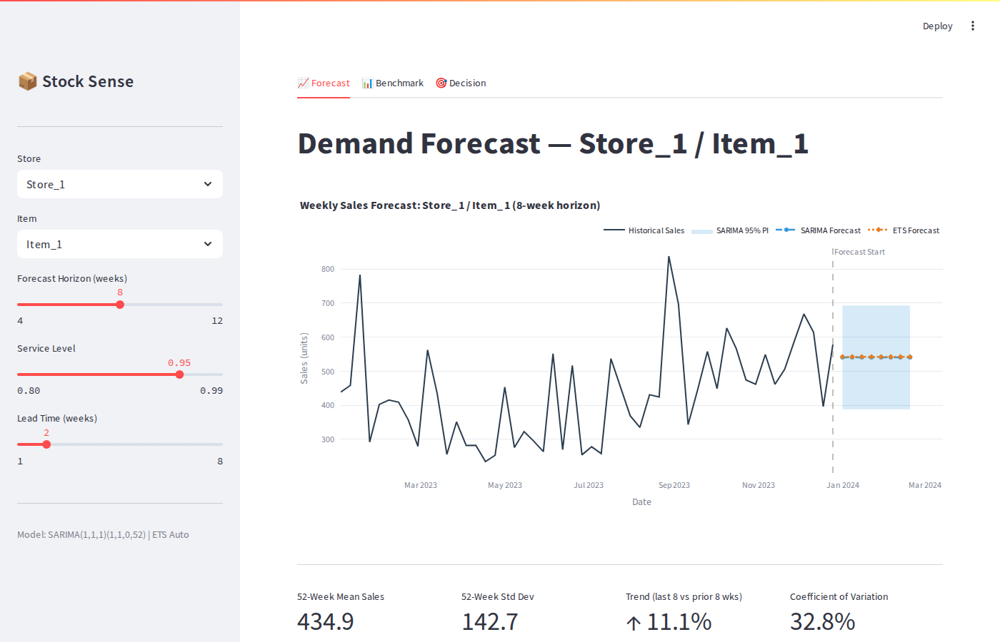
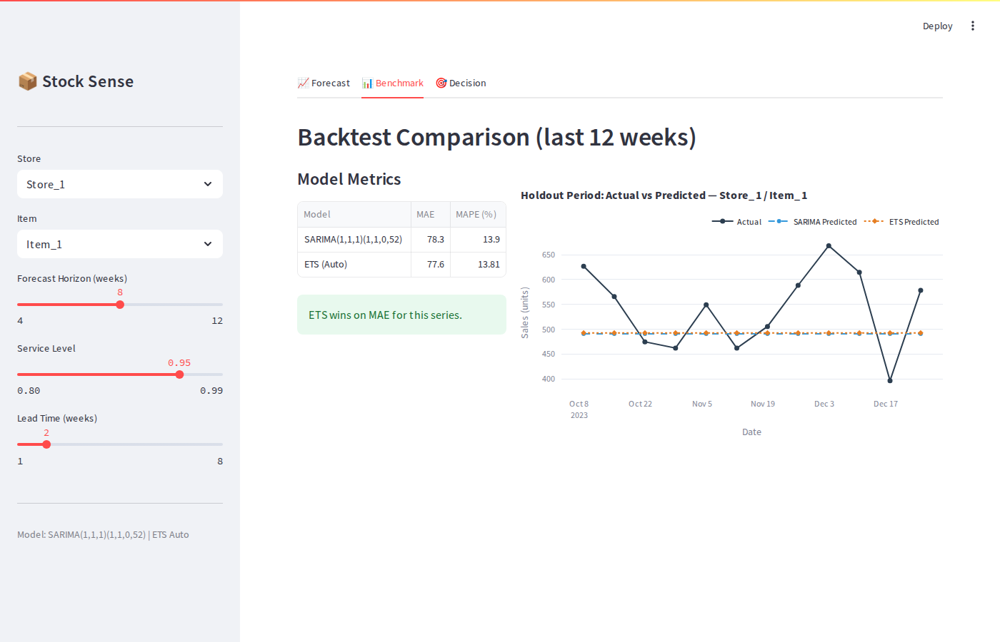
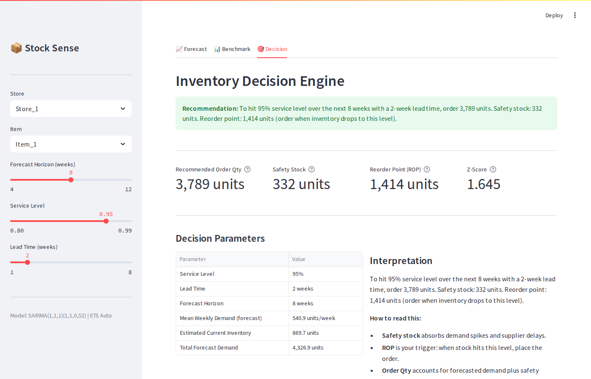

# Stock Sense — Time-Series Forecasting as a Decision Tool

A retail demand forecasting application that benchmarks two time-series models and translates every forecast into a concrete, mathematically grounded inventory action.

The point of this project is not the model — it is the **decision**. A forecast that nobody acts on is useless. Stock Sense closes the loop: it produces probabilistic demand forecasts, exposes their uncertainty honestly via prediction intervals, and converts that uncertainty into a safety-stock calculation and a reorder recommendation in plain business language.

---

## Screenshots







---

## How It Works

### 1. Data

The application ships with a synthetic-but-realistic retail sales dataset (3 stores x 5 items, 156 weeks, 2021-01-04 to 2023-12-25). The generator (`data/generate_data.py`) superimposes four components on a log-normal base:

| Component | Implementation |
|---|---|
| Upward trend | Compound factor $(1 + 0.015)^{t/52}$ per year |
| Yearly seasonality | Von Mises kernel peaked in weeks 47-52 (holiday season), trough in weeks 1-8 |
| Promotional spikes | Bernoulli-sampled weeks (~19% rate) with a uniform multiplier $U[1.4, 1.8]$ |
| Noise | Lognormal multiplicative: $\varepsilon \sim \text{LogNormal}(0,\, 0.15)$ |

The dataset is stated as synthetic to avoid credential dependencies. It exhibits non-trivial seasonality, heteroskedasticity, and trend — the features that differentiate the two forecasting approaches.

### 2. Forecasting Models

#### Model 1 — SARIMA (Seasonal ARIMA)

The workhorse statistical baseline. The model is specified as $\text{SARIMA}(1,1,1)(1,1,0)_{52}$:

$$
\Phi_P(B^s) \phi_p(B)\, \nabla^d \nabla^D_s\, y_t = \Theta_Q(B^s) \theta_q(B)\, \varepsilon_t,
\quad \varepsilon_t \overset{\text{iid}}{\sim} \mathcal{N}(0, \sigma^2)
$$

where $B$ is the backshift operator, $\nabla^d = (1-B)^d$ is the non-seasonal difference operator, and $\nabla^D_s = (1-B^s)^D$ is the seasonal difference operator with period $s = 52$. With $p=d=q=1$ and $P=D=1,\, Q=0,\, s=52$, the expanded form is:

$$
(1 - \Phi_1 B^{52})(1 - \phi_1 B)(1 - B)(1 - B^{52})\, y_t = (1 + \theta_1 B)\, \varepsilon_t
$$

Parameters are estimated by maximum likelihood via the Kalman filter (Durbin & Koopman 2002) as implemented in `statsmodels.tsa.statespace.sarimax`. Prediction intervals are exact Gaussian from the state-space forecast covariance:

$$
\hat{y}_{t+h|t} \pm z_{\alpha/2} \cdot \sqrt{P_{t+h|t}}
$$

A non-seasonal fallback $\text{ARIMA}(1,1,1)$ is attempted if the seasonal fit diverges; a naive mean forecast is the final safety net.

#### Model 2 — AutoETS (Exponential Smoothing State Space)

An ETS model selected automatically by AIC minimization over the combinatorial space of additive/multiplicative/none for error, trend, and seasonality. Implemented via `statsforecast.models.AutoETS` (Nixtla) with `season_length=52`.

The additive ETS state-space form (Hyndman et al. 2002) is:

$$
y_t = \ell_{t-1} + b_{t-1} + s_{t-m} + \varepsilon_t
$$

$$
\ell_t = \ell_{t-1} + b_{t-1} + \alpha\, \varepsilon_t, \qquad
b_t = b_{t-1} + \beta\, \varepsilon_t, \qquad
s_t = s_{t-m} + \gamma\, \varepsilon_t
$$

where $\ell_t$ is the level, $b_t$ the trend, $s_t$ the seasonal component, $m = 52$, and $\alpha, \beta, \gamma \in [0, 1]$ are smoothing weights. AutoETS selects the model minimizing:

$$
\text{AIC} = -2\ln\hat{L} + 2k
$$

On three annual cycles of data the optimizer typically selects ETS(A,N,N) — simple exponential smoothing — because seasonal parameters are not well identified. This produces flat forecasts and is the correct statistical outcome. A fallback to `statsmodels.tsa.holtwinters.ExponentialSmoothing` (additive trend, additive seasonal) with simulation-based prediction intervals (500 draws) is activated if `statsforecast` fails to import.

### 3. Backtest Protocol

A single fixed-origin holdout:

- Train window: weeks $1$ to $T - 12$
- Test window: weeks $T - 11$ to $T$ ($h = 12$ weeks)

Error metrics:

$$
\text{MAE} = \frac{1}{h} \sum_{i=1}^{h} \left| y_{T+i} - \hat{y}_{T+i} \right|
$$

$$
\text{MAPE} = \frac{100}{h} \sum_{i=1}^{h} \left| \frac{y_{T+i} - \hat{y}_{T+i}}{y_{T+i}} \right|
$$

Results are shown side by side in the Benchmark tab with an automatic winner annotation.

### 4. Decision Layer — Inventory Optimization

This is the soul of the application. Given a point forecast $\{\hat{y}_{t+1}, \ldots, \hat{y}_{t+H}\}$, a target **service level** $\alpha \in [0.80, 0.99]$, and a **lead time** $L$ (weeks), the following quantities are computed in closed form.

**Z-score from service level:**

$$
z_\alpha = \Phi^{-1}(\alpha)
$$

where $\Phi^{-1}$ is the quantile function of the standard normal distribution, evaluated via `scipy.stats.norm.ppf`. Typical values: $z_{0.90} = 1.282$, $z_{0.95} = 1.645$, $z_{0.99} = 2.326$.

**Safety stock:**

Demand variance during a lead time of $L$ independent periods is $\sigma_{\text{LT}}^2 = L \cdot \sigma_d^2$, giving:

$$
\text{SS} = z_\alpha \cdot \sigma_d \cdot \sqrt{L}
$$

$\sigma_d$ is estimated from the trailing 52 weeks of historical demand rather than from the forecast vector (which may be a flat line from ETS(A,N,N) and would understate true variability).

**Reorder point:**

$$
\text{ROP} = \bar{d} \cdot L + \text{SS}
$$

where $\bar{d} = H^{-1}\sum_{i=1}^H \hat{y}_{t+i}$ is mean forecast weekly demand.

**Recommended order quantity:**

$$
Q = \max\!\left(0,\; \sum_{i=1}^{H} \hat{y}_{t+i} + \text{SS} - I_0\right)
$$

where $I_0 \approx 2\,\bar{d}_{\text{hist}}$ is the estimated on-hand inventory (two weeks of trailing mean historical demand). Dragging the service-level slider recomputes $z_\alpha$, $\text{SS}$, $\text{ROP}$, and $Q$ in real time.

---

## System Design

```
┌─────────────────────────────────────────────────────────┐
│                    app.py  (Streamlit)                   │
│                                                          │
│  Sidebar controls                                        │
│  store / item / horizon / service_level / lead_time      │
│                                                          │
│  Tab 1: Forecast                                         │
│    @st.cache_data --> src/forecasting.fit_sarima()       │
│    @st.cache_data --> src/forecasting.fit_ets()          │
│    Plotly: historical + forecast + 95% PI shading        │
│                                                          │
│  Tab 2: Benchmark                                        │
│    @st.cache_data --> src/forecasting.run_backtest()     │
│    MAE / MAPE table  +  actual-vs-predicted chart        │
│                                                          │
│  Tab 3: Decision                                         │
│    src/decision.compute_inventory_decision()  (no cache) │
│    Callout box + st.metric cards + parameter table       │
└──────────────────────────────┬──────────────────────────┘
                               │
              ┌────────────────┴────────────────┐
              ▼                                  ▼
┌─────────────────────────┐      ┌───────────────────────────┐
│   src/forecasting.py    │      │   src/decision.py          │
│                         │      │                            │
│   fit_sarima()          │      │   compute_inventory_       │
│     statsmodels SARIMAX │      │   decision()               │
│     3-level fallback    │      │                            │
│                         │      │   scipy.stats.norm.ppf()   │
│   fit_ets()             │      │   SS = z * sigma * sqrt(L) │
│     statsforecast AutoETS│     │   ROP = d_bar * L + SS     │
│     3-level fallback    │      │   Q = sum(fc) + SS - I0    │
│                         │      │                            │
│   run_backtest()        │      └───────────────────────────┘
│     MAE, MAPE           │
└─────────────────────────┘
              │
              ▼
┌─────────────────────────┐
│   data/sales_data.csv   │ <-- data/generate_data.py
│   2,340 rows            │     (synthetic, seed=42)
│   3 stores x 5 items    │
│   156 weeks             │
└─────────────────────────┘
```

### Caching strategy

All forecasting calls are wrapped with `@st.cache_data` keyed on `(store_id, item_id, horizon, n_train)`. SARIMA fits on 156 weekly observations take approximately 5 seconds; without caching, every sidebar interaction would re-trigger the MLE optimization. The decision layer is not cached because it is pure NumPy arithmetic over a small array and runs in under 1 ms — re-executing on every service-level slider drag is intentional and gives the user live feedback.

### Fallback chain

```
SARIMA(1,1,1)(1,1,0,52)   -->  ARIMA(1,1,1)          -->  Naive mean +/- 1.96 sigma
AutoETS(season_length=52)  -->  HoltWinters(add,add)   -->  Naive mean +/- 1.96 sigma
```

The app never crashes on a store/item combination that lacks sufficient data for the full seasonal model.

---

## Run It

```bash
git clone https://github.com/BillKladis/Time-Series-Forecasting-as-a-Decision-Tool.git
cd Time-Series-Forecasting-as-a-Decision-Tool
pip install -r requirements.txt
# Add your key to .env (not required for forecasting — reserved for future LLM integration)
streamlit run app.py
```

The dataset is already bundled at `data/sales_data.csv`. To regenerate it:

```bash
python data/generate_data.py
```

To re-capture screenshots after changes (requires a system Chromium build):

```bash
playwright install chromium
python capture_screenshots.py
```

---

## Design Choices and Limitations

The dataset is synthetic. It was generated rather than downloaded from Kaggle or a real retailer to keep the project runnable without authentication dependencies. The generator replicates the statistical structure of real retail series — trend, yearly seasonality, promotional spikes, multiplicative noise — closely enough to produce meaningful forecasts and benchmarks, but the absolute sales figures are not calibrated to any real product category.

AutoETS frequently selects ETS(A,N,N) (simple exponential smoothing) on this dataset because only three complete seasonal cycles are available, which is insufficient to identify 52 seasonal parameters with confidence. This produces flat forecasts. The decision layer compensates by deriving safety stock from trailing historical variance rather than from forecast variance, so the inventory recommendation remains sensible even when the model collapses to the mean. A production deployment would retrain on rolling windows of at least five years.

The backtest uses a single fixed-origin split rather than rolling-origin cross-validation. Rolling-origin evaluation would be statistically sounder but adds significant latency in a Streamlit context. For a prototype illustrating the benchmark concept, the single split is sufficient.

The current-inventory estimate ($I_0 = 2\bar{d}_{\text{hist}}$) is a placeholder. In a production system this would come from a live ERP or WMS feed. The safety-stock formula also assumes demand is i.i.d. across weeks within the lead time, which ignores autocorrelation present in the historical series. A more rigorous treatment would propagate the forecast error covariance through the lead-time window.
